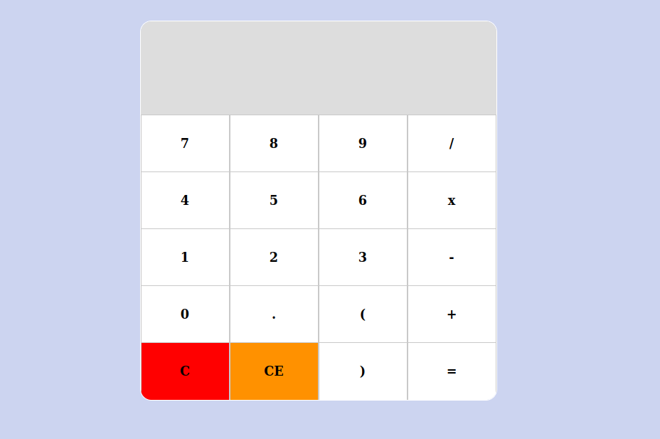

# Proyecto Calculadora

1) Funcionalidad del (.) para decimales

  Función action permite introducir punto solo una vez por número.
  Ej:   0.1   .1   2.55

2) Borrado del último carácter capturado con (←)

  Función action permite borrar el ultimo carácter capturado.

3) Orden de precedencia de los operadores

  Función doPrecedence envía a la función doCalculation para realizar las operaciones de división, multiplicación, suma y resta.

4) Lo que se encuentre dentro de paréntesis deben ser las operaciones que se realicen primero

  <<  Solo no realice el punto 4 :(  >>

5) Opcionalmente, agregar validaciones, evitar que pongan un símbolo antes de un número (exceptuando el - que indica negativo), evitar que pongan dos símbolos de operadores seguidos (debería sustituir el anterior).

  Función action solo permite introducir números y operadores siguiendo ciertas restricciones.

EXTRA: Agregue eventos para permitir introducir usando el teclado



## :package: Built With

- HTML
- CSS
- Javascript (ES6)

## :mag: Live Demo

[Live Demo Link](https://mcervantes71.github.io/Calculadora/index.html)

## :computer: Getting Started

To get a local copy up and running follow these simple steps.


### Download

1) Clone the repository to your local machine

```sh
  $ git clone https://github.com/mcervantes71/Calculadora.git
```

2) cd into the directory

```sh
  $ cd Calculadora
```

### Requirements

[Node.js](https://nodejs.org) is required to install dependencies and run scripts via `npm`.

### Usage

Install the dependencies in the local node_modules folder

```sh
  $ npm install
```

Build project and open web server running project

```sh
  $ npm start
```

## :busts_in_silhouette: Authors

👤 **Martin Cervantes**

- Linkedin: [Martin Cervantes](https://www.linkedin.com/in/cervantesmartin/)
- Twitter: [@M4rt1nC3rv4nt3s](https://twitter.com/M4rt1nC3rv4nt3s)
- Github: [@mcervantes71](https://github.com/mcervantes71)
- Gmail: [cervantes.martine](mailto:cervantes.martine@gmail.com)

## 🤝 Contributing

    Contributions, issues and feature requests are welcome!

Feel free to check the [issues page](../../issues).

## :star2: Show your support

    Give a ⭐️ if you like this project!

## 📝 License

This project is [MIT](lic.url) licensed.
